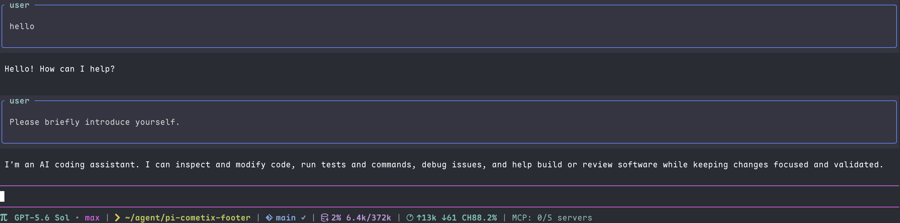

# pi-cometix-footer

[](https://www.npmjs.com/package/pi-cometix-footer)
[](./LICENSE)
[](https://pi.dev)

Single-line **cometix-style** footer for [pi](https://pi.dev) — model, path, git, context window, and session tokens at a glance.

Look inspired by [CCometixLine](https://github.com/Haleclipse/CCometixLine) (MIT). Independent pi extension; own codebase.

---

## Preview



```text
π  GLM-5.2 • high  |  > ~/Downloads/agent  |  🌿 master ✓  |  19% 186k/1.0M  |  ↑565k ↓83k CH99.8%
```

| Segment | What it shows | Color |
| --- | --- | --- |
| **Model** | Model name + thinking level (`• high`) | cyan · level uses pi palette |
| **Directory** | CWD, `~`-relative | yellow icon / green path |
| **Git** | Branch · clean `✓` / dirty `●` / conflict `⚠` · ahead `↑n` / behind `↓n` | blue |
| **Context** | Window fill `pct tokens/window` | magenta → yellow (>70%) → red (>90%) |
| **Tokens** | Session `↑in ↓out` + latest cache hit `CH%` | cyan |
| **Statuses** | Extension / MCP status lines (if any) | theme default |

Segments are bold, separated by dim ` | `, with Nerd Font icons (emoji fallback available).

---

## Install

```bash
pi install npm:pi-cometix-footer
```

Or from git:

```bash
pi install git:github.com/Xichun123/pi-cometix-footer
```

Then in pi:

```text
/reload
```

Footer is **on by default**. Toggle anytime:

```text
/cometix-footer
```

> **Migrating from a loose file?**  
> If you previously copied `cometix-footer.ts` into `~/.pi/agent/extensions/`, remove that file first to avoid loading the footer twice.

---

## Customize

Edit the installed package (or a local clone), then `/reload`.

| Knob | Where | Purpose |
| --- | --- | --- |
| `ICON_MODE` | top of `index.ts` | `"nerd"` (default) or `"emoji"` if no Nerd Font |
| `ICONS.nerd.*` | icon map | per-segment Nerd Font codepoints |
| `C.*` | color map | 16-color SGR codes per segment |
| `GIT_TTL` | near git cache | git status refresh interval (ms, default `3000`) |

Nerd Font cheatsheet: <https://www.nerdfonts.com/cheat-sheet>

Local install for hacking:

```bash
git clone https://github.com/Xichun123/pi-cometix-footer.git
pi install ./pi-cometix-footer
```

---

## Requirements

- [pi](https://pi.dev) (peer: `@earendil-works/pi-coding-agent`, `@earendil-works/pi-tui`)
- A [Nerd Font](https://www.nerdfonts.com/) in your terminal — or set `ICON_MODE = "emoji"`

---

## Credits

- Visual language borrowed from [CCometixLine](https://github.com/Haleclipse/CCometixLine) by Haleclipse (MIT)
- Built as a [pi](https://pi.dev) extension package

## License

[MIT](./LICENSE) © Xichun123
